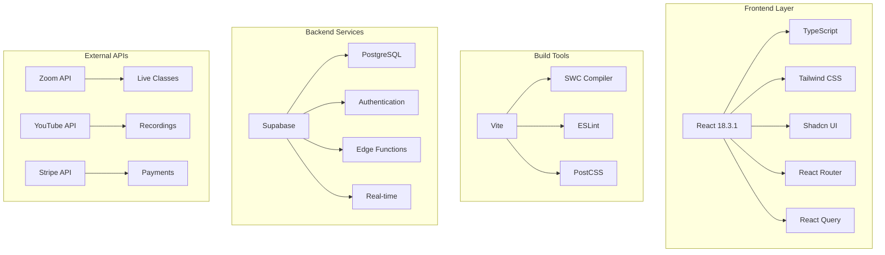

# 🏗️ System Architecture Documentation

## 📋 Overview

This English learning platform is built as a modern full-stack application with a React frontend, Supabase backend, and third-party integrations for video conferencing and content delivery.

## 🔧 Technology Stack



## 🎯 Application Architecture

### 🖼️ Frontend Architecture

```
┌─────────────────────────────────────────────┐
│                 App.tsx                     │
│  ┌─────────────┐ ┌─────────────────────────┐ │
│  │   Routing   │ │     Global Providers    │ │
│  │             │ │  - Auth Context         │ │
│  │ React Router│ │  - Query Client         │ │
│  │             │ │  - Toast Provider       │ │
│  └─────────────┘ └─────────────────────────┘ │
└─────────────────────────────────────────────┘
                        │
                        ▼
┌─────────────────────────────────────────────┐
│                Page Components              │
│  ┌─────────┐ ┌─────────┐ ┌─────────────────┐ │
│  │  Index  │ │Learning │ │    Contact      │ │
│  │  About  │ │Dashboard│ │    Pricing      │ │
│  │  Login  │ │  FAQ    │ │   Instructors   │ │
│  └─────────┘ └─────────┘ └─────────────────┘ │
└─────────────────────────────────────────────┘
                        │
                        ▼
┌─────────────────────────────────────────────┐
│              Feature Components             │
│  ┌─────────────────┐ ┌─────────────────────┐ │
│  │ Learning Tools  │ │   UI Components     │ │
│  │ - Calendar      │ │ - Button, Card      │ │
│  │ - Quiz          │ │ - Form, Input       │ │
│  │ - Flashcards    │ │ - Toast, Dialog     │ │
│  │ - Materials     │ │ - Navigation        │ │
│  └─────────────────┘ └─────────────────────┘ │
└─────────────────────────────────────────────┘
```

### 🗄️ Backend Architecture

```
┌─────────────────────────────────────────────┐
│                 Supabase                    │
│  ┌─────────────┐ ┌─────────────────────────┐ │
│  │ PostgreSQL  │ │    Edge Functions       │ │
│  │ Database    │ │  - zoom-meetings        │ │
│  │             │ │  - youtube-videos       │ │
│  │ - Users     │ │  - contact-inquiries    │ │
│  │ - Progress  │ │  - send-email           │ │
│  │ - Materials │ │  - create-checkout      │ │
│  └─────────────┘ └─────────────────────────┘ │
│  ┌─────────────┐ ┌─────────────────────────┐ │
│  │    Auth     │ │      Real-time          │ │
│  │             │ │                         │ │
│  │ - JWT       │ │ - Live updates          │ │
│  │ - Sessions  │ │ - Notifications         │ │
│  │ - Policies  │ │ - Chat                  │ │
│  └─────────────┘ └─────────────────────────┘ │
└─────────────────────────────────────────────┘
```

## 🔄 Data Flow Architecture

### 📊 Component Data Flow

```
User Interaction
       │
       ▼
┌─────────────┐    State Update    ┌─────────────┐
│  Component  │ ──────────────────▶ │ Local State │
│             │                    │             │
│ - User Input│ ◀──────────────────│ - Form Data │
│ - Events    │    Re-render       │ - UI State  │
└─────────────┘                    └─────────────┘
       │                                  │
       ▼                                  ▼
┌─────────────┐    API Call        ┌─────────────┐
│ Supabase    │ ◀──────────────────│   Actions   │
│ Client      │                    │             │
│             │ ──────────────────▶│ - Fetch Data│
│ - Database  │    Response        │ - Update    │
│ - Auth      │                    │ - Delete    │
└─────────────┘                    └─────────────┘
```

### 🌐 External Integration Flow

```
Frontend Components
       │
       ▼
┌─────────────────┐    HTTP Request    ┌──────────────────┐
│ Supabase Edge   │ ─────────────────▶ │  External APIs   │
│ Functions       │                   │                  │
│                 │ ◀─────────────────│ - Zoom API       │
│ - Authentication│    Response       │ - YouTube API    │
│ - Error Handling│                   │ - Stripe API     │
│ - Data Transform│                   │ - Email Service  │
└─────────────────┘                   └──────────────────┘
       │
       ▼
┌─────────────────┐
│   Frontend      │
│   Components    │
│                 │
│ - Display Data  │
│ - Handle Errors │
│ - Update UI     │
└─────────────────┘
```

## 📚 Learning Platform Core Features

### 🎓 Learning Management System

```
┌─────────────────────────────────────────────┐
│              Learning Dashboard             │
│                                             │
│  ┌─────────────┐ ┌─────────────────────────┐ │
│  │Live Classes │ │      Recordings         │ │
│  │             │ │                         │ │
│  │ - Zoom API  │ │ - YouTube Integration   │ │
│  │ - Scheduling│ │ - Video Playback        │ │
│  │ - Join Links│ │ - Progress Tracking     │ │
│  └─────────────┘ └─────────────────────────┘ │
│                                             │
│  ┌─────────────┐ ┌─────────────────────────┐ │
│  │ Materials   │ │    Interactive Tools   │ │
│  │             │ │                         │ │
│  │ - File Mgmt │ │ - Quiz System           │ │
│  │ - Downloads │ │ - Flashcards            │ │
│  │ - Categories│ │ - Calendar View         │ │
│  └─────────────┘ └─────────────────────────┘ │
└─────────────────────────────────────────────┘
```

### 🔐 Authentication & Authorization

```
┌─────────────────┐    Login/Register    ┌─────────────────┐
│   User Input    │ ───────────────────▶ │  Supabase Auth  │
│                 │                     │                 │
│ - Email/Pass    │ ◀───────────────────│ - JWT Tokens    │
│ - Social Login  │     Session         │ - Session Mgmt  │
└─────────────────┘                     └─────────────────┘
                                               │
                                               ▼
┌─────────────────┐    Protected Routes  ┌─────────────────┐
│ Route Guards    │ ◀──────────────────  │  Auth Context   │
│                 │                     │                 │
│ - Dashboard     │ ───────────────────▶│ - User State    │
│ - Learning      │    User Data        │ - Permissions   │
└─────────────────┘                     └─────────────────┘
```

## 🎨 UI/UX Architecture

### 🎭 Design System

```
┌─────────────────────────────────────────────┐
│                Design Tokens                │
│                                             │
│  ┌─────────────┐ ┌─────────────────────────┐ │
│  │   Colors    │ │       Typography        │ │
│  │             │ │                         │ │
│  │ - Primary   │ │ - Font Families         │ │
│  │ - Secondary │ │ - Font Sizes            │ │
│  │ - Semantic  │ │ - Line Heights          │ │
│  └─────────────┘ └─────────────────────────┘ │
│                                             │
│  ┌─────────────┐ ┌─────────────────────────┐ │
│  │  Spacing    │ │      Components         │ │
│  │             │ │                         │ │
│  │ - Margins   │ │ - Button Variants       │ │
│  │ - Padding   │ │ - Card Layouts          │ │
│  │ - Gaps      │ │ - Form Styles           │ │
│  └─────────────┘ └─────────────────────────┘ │
└─────────────────────────────────────────────┘
```

### 📱 Responsive Design

```
Mobile First Approach
       │
       ▼
┌─────────────┐    768px+     ┌─────────────┐    1024px+    ┌─────────────┐
│   Mobile    │ ─────────────▶│   Tablet    │ ─────────────▶│  Desktop    │
│             │               │             │               │             │
│ - Single    │               │ - Grid 2col │               │ - Grid 3col │
│ - Stack     │               │ - Sidebar   │               │ - Full Nav  │
│ - Drawer    │               │ - Tabs      │               │ - Complex   │
└─────────────┘               └─────────────┘               └─────────────┘
```

## 🔄 State Management Strategy

### 📊 State Architecture

```
┌─────────────────────────────────────────────┐
│                Application State            │
│                                             │
│  ┌─────────────┐ ┌─────────────────────────┐ │
│  │Global State │ │     Component State     │ │
│  │             │ │                         │ │
│  │ - Auth User │ │ - Form Data             │ │
│  │ - Theme     │ │ - UI Interactions       │ │
│  │ - Settings  │ │ - Local Preferences     │ │
│  └─────────────┘ └─────────────────────────┘ │
│                                             │
│  ┌─────────────┐ ┌─────────────────────────┐ │
│  │Server State │ │      Cache Layer        │ │
│  │             │ │                         │ │
│  │ - API Data  │ │ - React Query           │ │
│  │ - Real-time │ │ - Optimistic Updates    │ │
│  │ - Mutations │ │ - Background Sync       │ │
│  └─────────────┘ └─────────────────────────┘ │
└─────────────────────────────────────────────┘
```

## 🚀 Performance Architecture

### ⚡ Optimization Strategies

```
Build Optimization
       │
       ▼
┌─────────────┐    Code Split     ┌─────────────┐    Bundle    ┌─────────────┐
│   Source    │ ─────────────────▶│  Modules    │ ───────────▶│  Optimized  │
│             │                  │             │             │             │
│ - React SWC │                  │ - Route     │             │ - Tree Shake│
│ - TypeScript│                  │ - Component │             │ - Minified  │
│ - CSS       │                  │ - Lazy Load │             │ - Compressed│
└─────────────┘                  └─────────────┘             └─────────────┘
```

### 📡 Runtime Performance

```
┌─────────────────┐    Optimize      ┌─────────────────┐
│  Runtime Perf   │ ──────────────▶  │   Techniques    │
│                 │                 │                 │
│ - Virtual DOM   │                 │ - Memoization   │
│ - Reconciliation│                 │ - Lazy Loading  │
│ - Event System  │                 │ - Image Opt     │
└─────────────────┘                 └─────────────────┘
```

## 🔒 Security Architecture

### 🛡️ Security Layers

```
┌─────────────────────────────────────────────┐
│                 Security                    │
│                                             │
│  ┌─────────────┐ ┌─────────────────────────┐ │
│  │   Client    │ │        Server           │ │
│  │             │ │                         │ │
│  │ - HTTPS     │ │ - JWT Verification      │ │
│  │ - CSP       │ │ - Row Level Security    │ │
│  │ - XSS Prot  │ │ - API Rate Limiting     │ │
│  └─────────────┘ └─────────────────────────┘ │
│                                             │
│  ┌─────────────┐ ┌─────────────────────────┐ │
│  │    Data     │ │      External APIs      │ │
│  │             │ │                         │ │
│  │ - Encryption│ │ - API Key Management    │ │
│  │ - Validation│ │ - OAuth Flows           │ │
│  │ - Sanitize  │ │ - Webhook Security      │ │
│  └─────────────┘ └─────────────────────────┘ │
└─────────────────────────────────────────────┘
```

## 📈 Scalability Considerations

### 🔧 Horizontal Scaling

```
User Growth
     │
     ▼
┌─────────────┐    CDN         ┌─────────────┐    Database    ┌─────────────┐
│  Frontend   │ ─────────────▶ │  Supabase   │ ─────────────▶ │ PostgreSQL  │
│             │               │             │               │             │
│ - Static    │               │ - Edge Func │               │ - Read Rep  │
│ - Cached    │               │ - Global    │               │ - Sharding  │
│ - Optimized │               │ - Auto Scale│               │ - Pooling   │
└─────────────┘               └─────────────┘               └─────────────┘
```

This architecture supports growth through Supabase's managed infrastructure while maintaining performance and reliability.